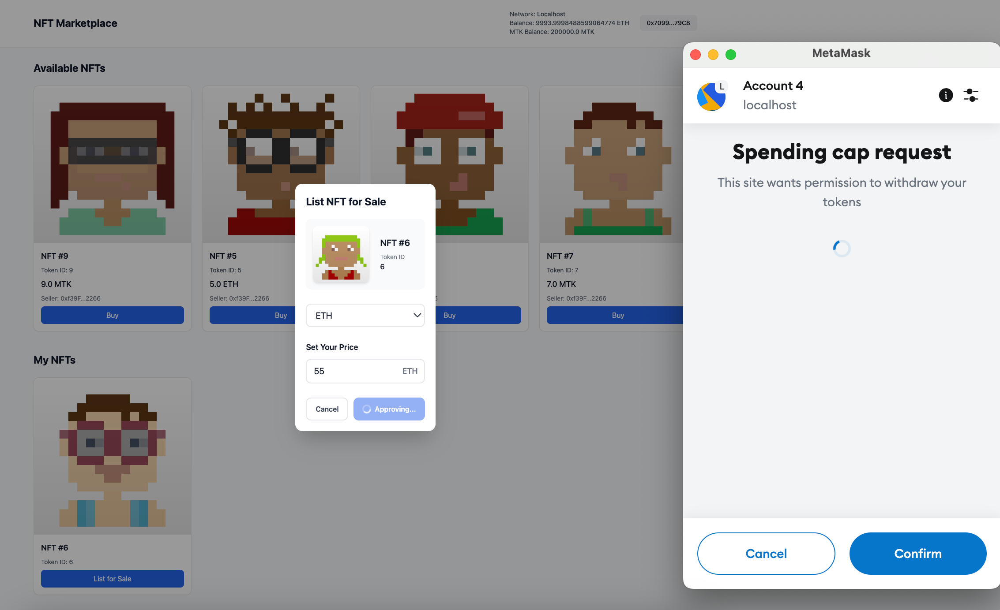

# CMD to run test with local node
- Run typechain: npx hardhat typechain
- Run node local: npx hardhat clean && npx hardhat compile && npx hardhat node
- Deploy contract: npx hardhat run scripts/hardhat/nft.ts --network localhost
  - There are three contracts:
    - MY_TOKEN_ADDRESS (ERC20 Token): '0x5FbDB2315678afecb367f032d93F642f64180aa3'
    - TRAINING_NFT: '0xCf7Ed3AccA5a467e9e704C703E8D87F634fB0Fc9'
    - MARKETPLACE_ADDRESS: '0xDc64a140Aa3E981100a9becA4E685f962f0cF6C9'

- Run client: cd client && npx nx serve client --skip-nx-cache

# Private wallet to test:

- Seller: 0xac0974bec39a17e36ba4a6b4d238ff944bacb478cbed5efcae784d7bf4f2ff80 
    for address 0xf39Fd6e51aad88F6F4ce6aB8827279cffFb92266
- Buyer: 0x59c6995e998f97a5a0044966f0945389dc9e86dae88c7a8412f4603b6b78690d
    for address 0x70997970C51812dc3A010C7d01b50e0d17dc79C8

After buying an NFT, the buyer can list it for sale to make a profit. At that point, they take on the role of the seller

# Note

- Trong giai đoạn test ban đầu, khi seller liệt kê NFT, không có pop-up "Spending Cap" vì hợp đồng đã gọi setApprovalForAll trong file nft.ts, cấp quyền cho marketPlaceContract quản lý tất cả NFT của seller.
- Khi buyer mua NFT và muốn list lại để bán với giá cao hơn, họ cần gọi approve để cho phép marketPlaceContract tương tác với NFT, vì quyền approve bị reset sau khi NFT được chuyển từ seller sang buyer.
- Tương tự, nếu seller mua lại NFT từ buyer và muốn liệt kê, họ cũng cần gọi approve lại do quyền approve bị reset khi NFT được chuyển.
